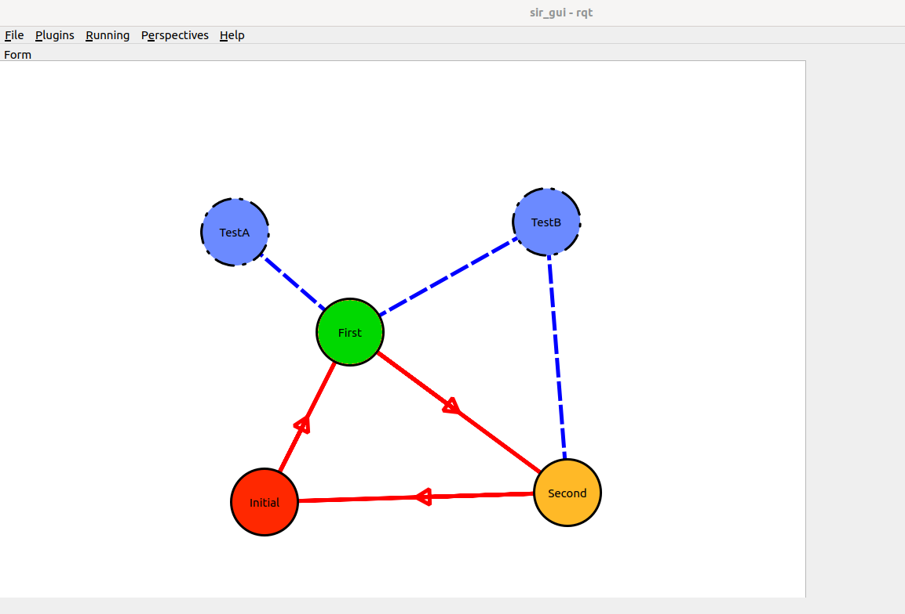

# rqt_cascade_hfsm

This package will use X to create hierarchical state machines visually.



## Usage

Build and run:

```
ros2 run rqt_gui rqt_gui 
```

Add the plugin in `Plugins->Visualization->Cascade HFSM` to create a FSM.

Save to generate a class (.hpp and .cpp) to which inherit and redefine the desired methods.
